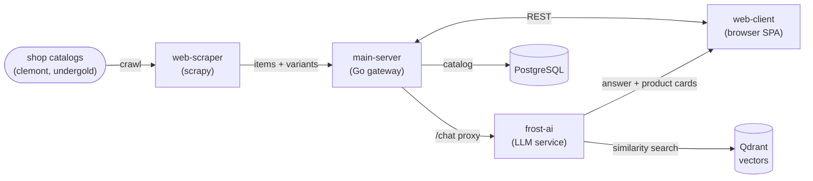

# Ice Wear Store

An AI chatbot for streetwear shopping. It ingests the public catalogs of two
brands — **Clemont** ([clemont.go](https://clemont.co)) and **Undergold**
([undergoldapparel.com](https://undergoldapparel.com)) — and lets users browse
and ask for product recommendations through a conversational assistant that
understands both **text and images**.

Ask it "show me a black oversized tee under $40" or drop in a photo of an outfit
you like, and it answers with real items from the crawled collections.

[](https://www.youtube.com/watch?v=Hx3P3bLS944)
[](https://www.youtube.com/watch?v=hqhJbz8XrlI)

> ### ⚠️ Disclaimer
>
> This is an **educational, non-commercial project** built solely for my personal
> portfolio. It does **not** generate any revenue and has **no commercial intent**.
>
> It is **not affiliated with, endorsed by, or connected to Clemont or Undergold**.
> Their publicly available catalog data is used only to demonstrate
> retrieval-augmented generation and multimodal search — there is no monetization,
> resale, or redistribution of their products.
>
> To Clemont and Undergold: this is a learning showcase only, with nothing to be
> concerned about. If either brand would like any changes or its data removed,
> I'll gladly comply on request.

## How it works



A user message hits `web-client`, which calls `main-server`. The gateway proxies
chat to `frost-ai`, which embeds the query, retrieves the closest catalog items
from Qdrant, and asks the LLM to compose an answer referencing those products.

## Services

### `web-scraper` — catalog crawler
Scrapy-based spiders that crawl the brand collections and emit normalized items
with their variants. Both stores run on Shopify, so the spiders share a
`_shopify_base` and specialize per brand (`clemont.py`, `undergold.py`). Output
is consumed by `main-server`'s populate command and stored in PostgreSQL.

### `frost-ai` — LLM answering service
A Python service that does retrieval-augmented recommendation. It uses a
deliberate split between providers — **OpenAI for answering, Google for computer
vision**:

| Task | Model | Provider |
| --- | --- | --- |
| Answering / chat completion | `o4-mini` | OpenAI |
| Text embeddings (user queries) | `text-embedding-3-small` | OpenAI |
| Image embeddings (user images) | `gemini-embedding-2` | Google |
| Image visual descriptions | `gemini-2.5-flash` | Google |

User-supplied images are first described visually with Gemini 2.5 Flash and
embedded separately, so the retrieval index keeps text and image vectors
distinct. **Qdrant** is the vector database backing similarity search over the
catalog. The service exposes a `POST /answer` endpoint (message + optional
`thread_id`) and maintains conversation threads.

### `main-server` — API gateway
A Go gateway that fronts everything the client talks to.

- **Go + Fiber** — HTTP server
- **Huma** — OpenAPI spec + typed handlers (served at `/openapi.json`)
- **Bun** — PostgreSQL ORM / query builder
- **PostgreSQL** — catalog storage (items, variants, sources)

It serves the catalog, handles image upload/hosting, and proxies `/chat`
requests to `frost-ai`. Commands live under `cmd/`: `api` (server), `migrate`
(schema), and `populate` (runs the scraper spiders and loads results into the DB).

### `web-client` — frontend
A **React + Vite** single-page app with a typed OpenAPI client generated from
`main-server`'s spec. Includes the chatbot UI with image-attachment support and
i18n.

## Tech stack

- **Scraping:** Python, Scrapy
- **AI:** Python, OpenAI (`o4-mini`, `text-embedding-3-small`), Google
  (`gemini-2.5-flash`, `gemini-embedding-2`), Qdrant
- **Gateway:** Go, Fiber, Bun, Huma (OpenAPI), PostgreSQL
- **Frontend:** React, Vite, TypeScript

## Getting started

**1. Configure the environment.** Copy `.env.example` to `.env` at the repo root
and fill in the values — every service reads from this single centralized file,
so it must be configured before anything will run:

```bash
cp .env.example .env
# then edit .env: set OPENAI_APIKEY, GOOGLE_API_KEY, DB_DSN, QDRANT_URL, etc.
```

**2. Spin up the infrastructure** (Qdrant + PostgreSQL):

```bash
make infra        # or: docker compose up -d
```

**3. Set up the database** — one command runs migrations, crawls the catalogs,
generates item descriptions, and builds the vector embeddings:

```bash
make setup
```

**4. Run the services.** For development, run each from its own directory — see
the per-service `README.md` and `Makefile` for run commands:

- `frost-ai/` — `uv` + Python
- `main-server/` — Go (`make dev` for hot reload)
- `web-client/` — `bun`
- `web-scraper/` — `uv` + Scrapy

## Production

Build and run all three services in production mode with a single command:

```bash
make prod        # or: ./scripts/start-prod.sh
```

This compiles the `main-server` Go binary, syncs `frost-ai` dependencies, and
builds the `web-client` static bundle, then launches all three together. Press
Ctrl+C to stop everything.

- Services read ports from the root `.env` (`MAIN_SERVER_PORT`, `FROST_AI_PORT`).
  The web client is served by `vite preview` on `WEB_CLIENT_PORT` (default `4173`):
  `WEB_CLIENT_PORT=8080 make prod`.
- `web-client` bakes `VITE_API_BASE_URL` into the bundle **at build time**, so
  point it at the production `main-server` URL in `.env` before running — changing
  it afterward requires a rebuild.
